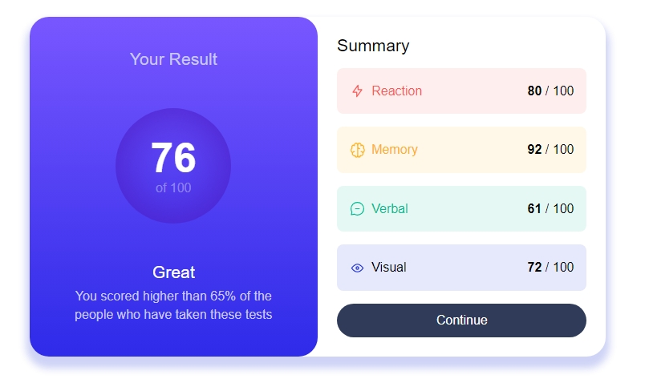

# Frontend Mentor - Results summary component solution

This is a solution to the [Results summary component challenge on Frontend Mentor](https://www.frontendmentor.io/challenges/results-summary-component-CE_K6s0maV). Frontend Mentor challenges help you improve your coding skills by building realistic projects. 

## Table of contents

- [Overview](#overview)
  - [The challenge](#the-challenge)
  - [Screenshot](#screenshot)
  - [Links](#links)
- [My process](#my-process)
  - [Built with](#built-with)
  - [What I learned](#what-i-learned)
- [Author](#author)


**Note: Delete this note and update the table of contents based on what sections you keep.**

## Overview

### The challenge

Users should be able to:

- View the optimal layout for the interface depending on their device's screen size
- See hover and focus states for all interactive elements on the page
- **Bonus**: Use the local JSON data to dynamically populate the content

### Screenshot




### Links

- Solution URL: [Add solution URL here](https://github.com/dimitrisdr/results-summary-component-main-react.git)
- Live Site URL: [Add live site URL here](https://dimitrisdr.github.io/results-summary-component-main-react/)

## My process

### Built with

- Semantic HTML5 markup
- CSS custom properties
- Flexbox
- CSS Grid
- Mobile-first workflow
- [React](https://reactjs.org/) - JS library
- [Styled Components](https://styled-components.com/) - For styles


### What I learned


```html
    <section className="summary-container grid-item" >
        <h2 className="title summary-title txt-light-lavender">Your Result</h2> 
        <div className="stats-container grid-item">
            <span className="main-perc fw-700 txt-white">76</span>
            <span className="secondary-perc txt-light-lavender">of 100</span>
        </div>
        <div className="summary__info-container grid-item">
            <h2 className="title secondary-title fw-500 txt-white">Great</h2>
            <p className="info-text txt-light-lavender">
                You scored higher than 65% of the people who
                have taken these tests
            </p>
        </div>  
    </section>
```
```css
.stat-box-title::before {
    content:'';
    width: 1.2rem;
    aspect-ratio: 1;
    background-image:var(--icon-url);
    background-repeat: no-repeat;
    background-size: cover;
}

```
```js
import StatBoxItem from './statBoxItem';
import data from '../data.json'


export default function Info() {
    return (
        <section className='info-container grid-item'>
            <h2 className="info fw-500">Summary</h2>
            <ul className="stats-box-items grid-item">
                {data.map((item, i) => {
                    return (<StatBoxItem item={item} i={i} key={i}/>) 
                })}
            </ul>
            <button className="btn continue-btn txt-white">Continue</button>
        </section>
    )
}
```

## Author

- Frontend Mentor - [@dimitrisdr](https://www.frontendmentor.io/profile/dimitrisdr)
